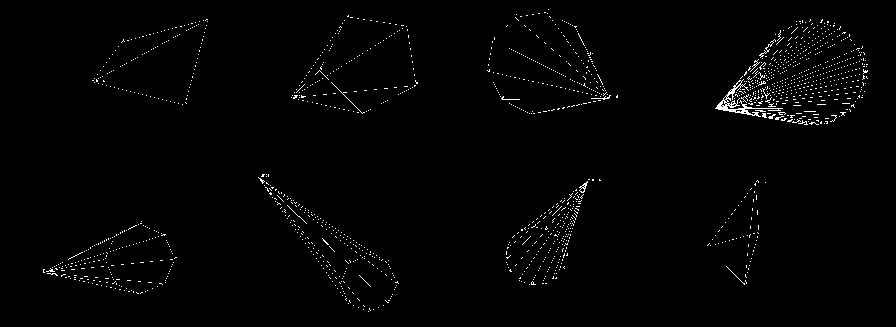
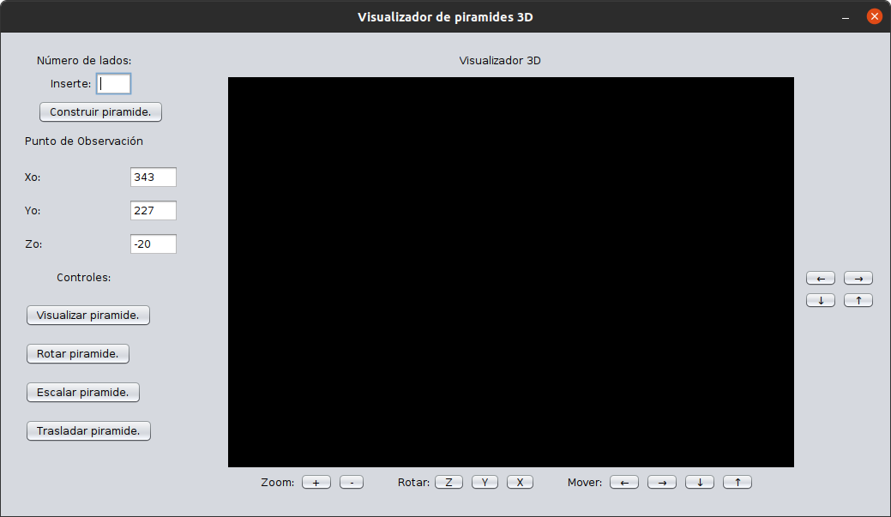
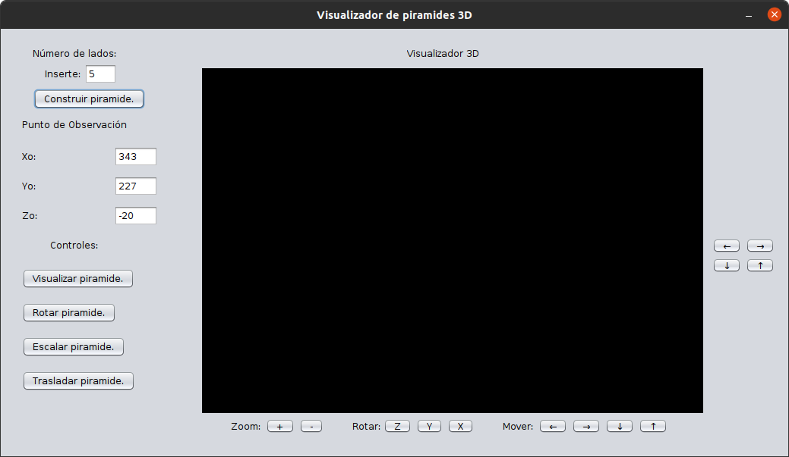
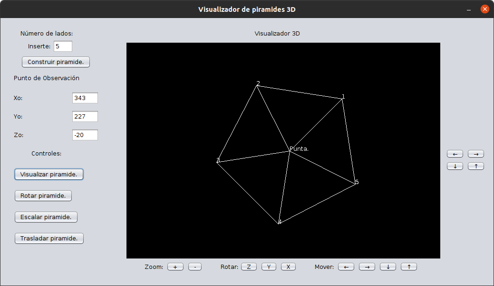
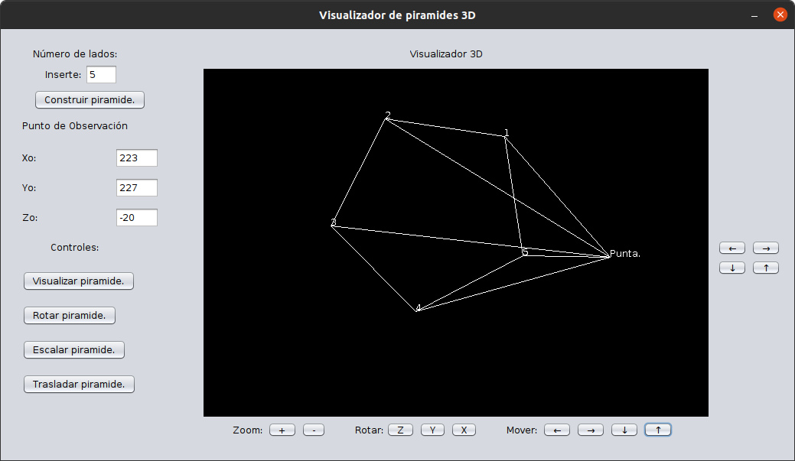

# 3D pyramid: Implementation of the basic linear algebra operations used 3D computer graphics.

A project to implement the basis of 3D computer graphics. Perform (and visualize) several operations over an n-sided 3D pyramid.

Note: The code comments and the user interface are in *Spanish*, translation is in progress, but you are free to translate the code if you need it.

## Requirements
- java 14
- javac 14
- Optional: Shell if you want to run the run.sh script.

## Instructions
1. Clone the repository: git clone https://github.com/gallardorafael/3dpyramid.git
2. You should have Java Runtime Environment installed
3. Navigate to the 3dpyramid folder
4. Make the run.sh file an executable: chmod +x run.sh (this script compiles all the java files and then run the UI.class file)
5. Run the script: ./run.sh
  1. OR: You can just run the JAR file: java -jar jar/UI.jar
6. You should see the user interface of the software (something similar to the following figure)

## Demo
1. Open the software

2. Insert the number of sides (e.g. 4) and click the "Construir piramide" button:

3. Visualize the pyramid by clicking the "Visualizar piramide" button:

4. Use the controls to rotate the pyramid (x,y and z axes), to move the centroid or to zoom in and zoom out (scale) the figure.

5. Enjoy the visualizations.
